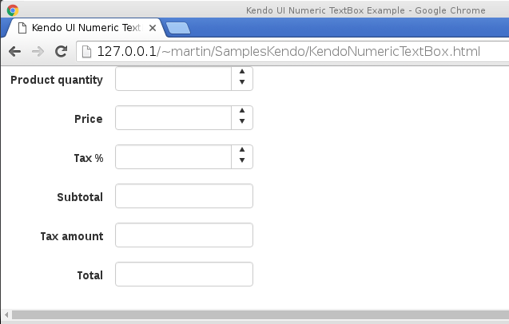
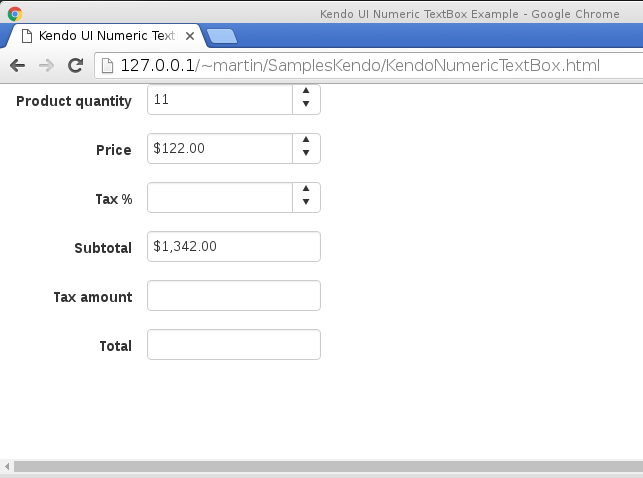
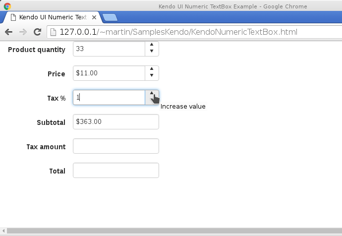
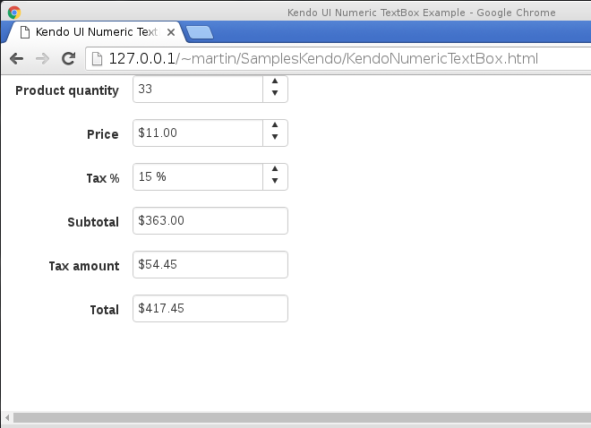

# Cómo utilizar el control Kendo UI NumericTextBox
		

El control <b>Kendo UI NumericTextBox</b> está diseñado para dar formato numérico y limitar los datos de entrada de los controles INPUT únicamente a los rangos que se especifiquen según sea especificado en la configuración del control.

Entre los formatos que este control puede manejar se encuentran las siguientes:

		<ul>
		  <li>Monedas</li>
		  <li>Porcentaje</li>
		  <li>Números enteros</li>
		  <li>Números con precisión</li>
		</ul>

Además si se utiliza el control con la sentencia <i>kendo.culture</i> este control puede dar formato de acuerdo al lenguaje y a las propiedades especificas de cada región o cultura.

Bien ahora mostraré un código en donde se verán todas las propiedades de este control, en este ejemplo se muestran 6 controles <b>Kendo NumericTextBox</b>, 4 de ellos configurado para mostrar cantidades monetarias, 1 de ellos configurado para mostrar cantidades enteras y el último para mostrar una cantidad porcentual.

<b>Fig 1</b> La ejecución de la página con 6 controles NumericTextBox.
 

 

Introduciendo los valores, observamos como los controles le dan formato numérico a las entradas de datos.

	
<b>Fig 2</b> Primer ejemplo: Introduciendo las cantidades numéricas.
 

 

<b>Fig 3</b> Completando las entradas numéricas del primer ejemplo.
 

 

<b>Fig 4</b> Un segundo ejemplo, introduciendo las cantidades numéricas.
 

 

<b>Fig 5</b> Un segundo ejemplo, completando las entradas numéricas.
 

 

Como primer paso hago la iniciación de los controles, con la sintaxis:

Aquí algunas de las propiedades que utilizo en los controles de este ejemplo:
<ul>
<li><b>format:</b> Especifica el tipo de formato que se usará en la cantidad numérica. Su valor predeterminado es   numérico “n”. </li>
<li><b>spinners:</b> Con esta propiedad se muestran las flechas de incremento/decremento del control.</li>
</ul>

Algunos de los eventos que utilizo:

<ul>
<li><b>change:</b> Este evento se ejecuta cuando el valor del control se cambia.</li>
</ul>

